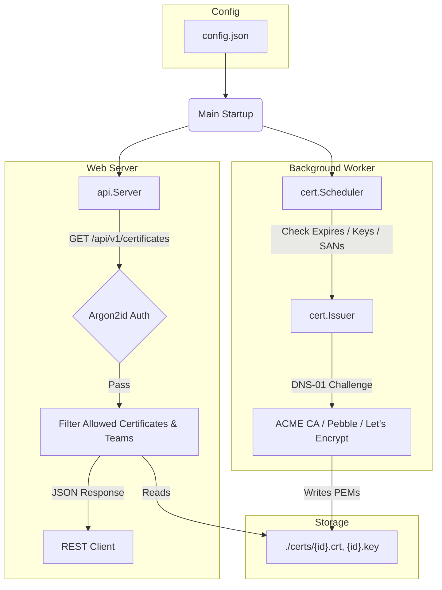

# GEMINI: AI Agent Developer Context & Guidelines

This file provides system context, architectural constraints, and development guidelines for AI coding assistants working on the `certer` codebase.

---

## Codebase Map

- `cmd/server/main.go`: Daemon bootstrap. Configures structured logger, parses config, registers background scheduler, and starts API server.
- `cmd/keygen/main.go`: Independent command line tool used to generate secure API tokens and their Argon2id hashes.
- `cmd/audit/main.go`: Statically compiled CLI utility used to generate comprehensive reports of the current teams, certificates, and API keys.
- `internal/app/config/config.go`: Configuration models and loader. Supports defaults, JSON configs (`config.json`), environment overrides, and auto-generates missing UUIDs on startup.
- `internal/app/cert/`: Core certificate automation logic.
  - `user.go`: Implements Lego's `registration.User` interface.
  - `issuer.go`: ACME communication wrapper. Implements `CertificateIssuer` interface. Handles DNS-01/HTTP-01 solvers.
  - `scheduler.go`: Expiration checking, private key existence verification, and configuration monitoring loops.
- `internal/app/api/`: REST routing, handlers, and token hashing.
  - `handler.go`: Core HTTP server initialization, middleware, and table-driven routing.
  - `api_keys_handler.go`, `certs_handler.go`, `teams_handler.go`: Resource-specific CRUD handlers.
  - `auth.go`: Argon2id verification and hash generation helpers.
  - `helpers.go`: Shared context accessors and JSON helpers.
- `openapi.json`: OpenAPI v3 specification file mapping all client and control plane APIs.

---

## System Architecture



---

## Critical Development Constraints

1. **Test-Driven Development (TDD)**:
   - Always write tests first.
   - Mock external dependencies. Do not make network calls to real CAs or require external DNS configurations during test execution.
   - Use `crypto/x509` in tests to construct self-signed x509 certificates to validate expiry, private keys, and domain names check logic.

2. **Security & Cryptography**:
   - **No Plain-text Tokens**: Never store token credentials in configuration files.
   - **Argon2id**: All API token matching must utilize the Argon2id key derivation function with parameters:
     - Memory: `65536 KB`
     - Iterations (Time): `3`
     - Parallelism (Threads): `2`
     - Salt: Random 16-byte cryptographically secure (`crypto/rand`).
   - Constant-time verification (`crypto/subtle.ConstantTimeCompare`) must be enforced.

3. **Routing & Handler Guidelines**:
   - Use Go 1.22+ native routing rules on `http.ServeMux` (e.g. `PUT /api/v1/config/certificates/{id}`).
   - Avoid introducing external router frameworks.
   - **Table-Driven Routing**: Define and register all routes using the table-driven pattern in `Routes()` for unified middleware application and clarity.
   - **Generic CRUD Helpers**: Use generic slice and decoding helpers (`decodeBody`, `findByID`, `removeAtIndex`) to handle JSON parsing and item mutations inside handler methods.

4. **Identities & Referential Integrity**:
   - **UUIDv7**: Configuration entries (Certificates, API Keys, and Teams) are identified exclusively by server-generated UUID v7 strings.
   - **Referential Integrity**: Before deleting a Team configuration, handlers must verify it is not in use by any configured certificates (`team_id`) or API keys (`allowed_teams`). Return `400 Bad Request` if a reference exists.
   - **Type-safe Context Access**: Never use unchecked type assertions like `r.Context().Value(Key).([]string)` directly inside route handlers. Always wrap context claims retrieval in helper functions (`allowedCertificatesFromContext`, `allowedTeamsFromContext`).

5. **Structured Logging**:
   - Use structured logs (`log/slog`) with key-value descriptors.
   - Print human-readable operational events but avoid dumping raw certificate strings or private keys to stdout.

---

## Standard workflows for testing

Run all tests:
```bash
go test -v ./...
```

Run test suite of a specific package:
```bash
go test -v ./internal/app/cert
go test -v ./internal/app/api
```
