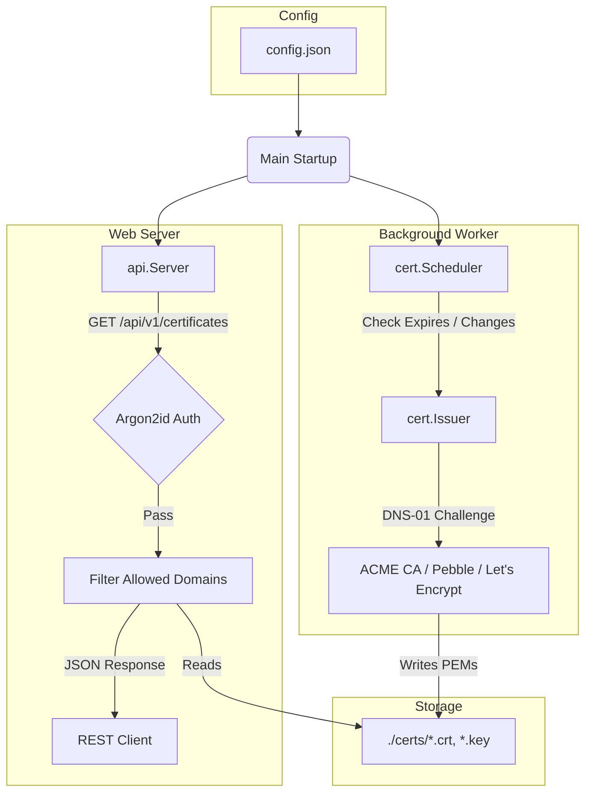

# GEMINI: AI Agent Developer Context & Guidelines

This file provides system context, architectural constraints, and development guidelines for AI coding assistants working on the `cert-central` codebase.

---

## Codebase Map

- `cmd/server/main.go`: Daemon bootstrap. Configures structured logger, parses config, registers background scheduler, and starts API server.
- `cmd/keygen/main.go`: Independent command line tool used to generate secure API tokens and their Argon2id hashes.
- `internal/app/config/config.go`: Configuration loader supporting JSON configs (`config.json`) and environment variable fallbacks.
- `internal/app/cert/`: Core certificate automation logic.
  - `user.go`: Implements Lego's `registration.User` interface.
  - `issuer.go`: ACME communication wrapper. Implements `CertificateIssuer` interface. Handles DNS-01/HTTP-01 solvers.
  - `scheduler.go`: Expiration checking and configuration monitoring loops.
- `internal/app/api/`: REST routing and token hashing.
  - `handler.go`: HTTP handler logic. Exposes authenticated endpoint for sharing certificate PEM payloads.
  - `auth.go`: Argon2id verification and hash generation helpers.

---

## System Architecture



---

## Critical Development Constraints

1. **Test-Driven Development (TDD)**:
   - Always write tests first.
   - Mock external dependencies. Do not make network calls to real CAs or require external DNS configurations during test execution.
   - Use `crypto/x509` in tests to construct self-signed x509 certificates to validate expiry and domain names check logic.

2. **Security & Cryptography**:
   - **No Plain-text Tokens**: Never store token credentials in configuration files.
   - **Argon2id**: All API token matching must utilize the Argon2id key derivation function with parameters:
     - Memory: `65536 KB`
     - Iterations (Time): `3`
     - Parallelism (Threads): `2`
     - Salt: Random 16-byte cryptographically secure (`crypto/rand`).
   - Constant-time verification (`crypto/subtle.ConstantTimeCompare`) must be enforced.

3. **Routing Guidelines**:
   - Use Go 1.22+ native routing rules on `http.ServeMux` (e.g. `GET /path`, `POST /path`).
   - Avoid introducing external router frameworks.

4. **Structured Logging**:
   - Use structured logs (`log/slog`) with key-value descriptors.
   - Print human-readable operational events but avoid dumping raw certificate strings or private keys to stdout.

---

## Standard workflows for testing

Run all tests:
```bash
go test -v ./...
```

Run test suite of a specific package:
```bash
go test -v ./internal/app/cert
go test -v ./internal/app/api
```
